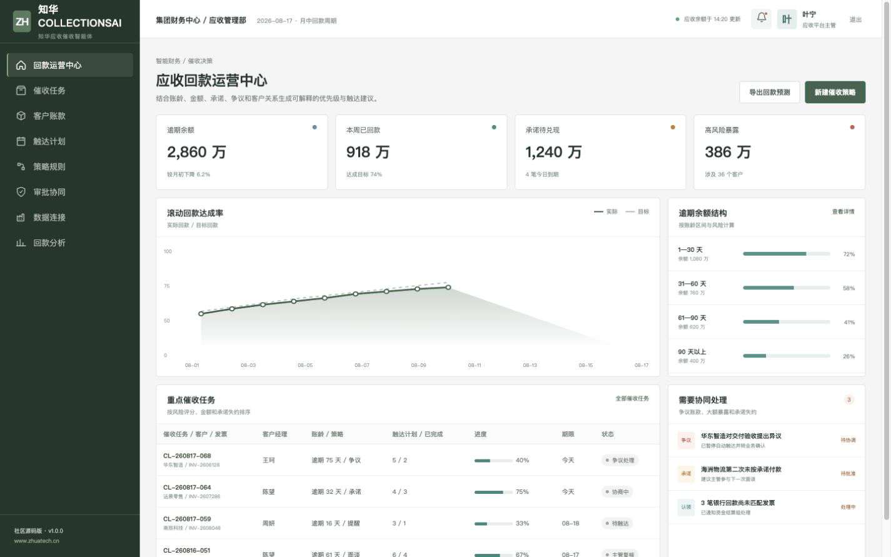
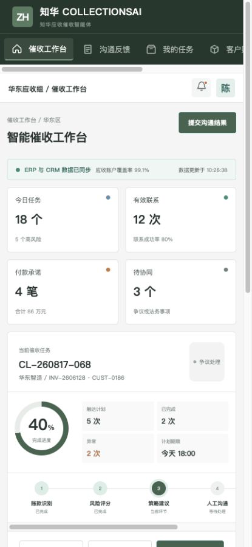

# 知华应收催收智能体（CollectionsAI）

**逾期金额很多，但催收时间有限。CollectionsAI 用可解释规则帮助团队决定“先处理谁、为什么、下一步做什么”。**

[知华科技官网](https://www.zhuatech.cn/) ｜ [API 文档](docs/api.md) ｜ [架构说明](docs/architecture.md) ｜ [部署指南](deploy/README.md)

版权所有 © 2026 上海如静知华信息科技有限公司。Java 根包：`cn.zhuatech.collectionsai`。

## 今日回款简报

| 指标 | 演示值 | 系统如何使用 |
| --- | ---: | --- |
| 逾期余额 | 2,860 万元 | 结合账龄和金额判断暴露 |
| 本周付款承诺 | 1,240 万元 | 跟踪承诺日期与失约次数 |
| 高风险客户 | 36 个 | 优先分配人工沟通 |
| 争议账款 | 3 项 | 暂停自动触达，转业务/法务 |



管理端面向应收主管，展示回款趋势、账龄结构、任务优先级、数据连接和审批协同。



H5 面向催收专员，支持查看客户账款、记录沟通、维护承诺和升级争议事项。

## 决策逻辑与功能

- `POST /api/ai/collections/score` 根据逾期天数、金额、承诺失约、最近联系、争议和战略客户属性给出风险分层
- 推荐友好提醒、付款承诺、主管协商或争议处理策略
- 大额动作、争议账款和战略客户保留人工审批
- ERP 应收、CRM 客户关系和银企流水的演示连接台账
- Spring Boot + Vue 3 + MySQL + Flyway + JWT + Docker Compose
- 规则全部本地可测，不依赖外部模型或 API Key

## 运行方式

```bash
cd frontend
npm install
npm run dev:demo
```

管理端：`planner / Demo@2026`；业务端：`operator / Demo@2026`。所有客户、发票、金额与人员均为虚构演示数据，不得用于真实催收决策。

## 许可与服务

本工程仅供个人、非商业学习、研究与技术交流，**禁止商用**。企业内部生产使用、真实客户或财务数据处理、部署、SaaS、实施交付、收费服务、品牌替换及二次销售，须取得上海如静知华信息科技有限公司书面授权，完整条款见 [LICENSE](LICENSE)。

需要智能财务、应收管理、ERP/CRM 集成、AI 私有化、软件项目外包或深度定制，可访问[知华科技官网](https://www.zhuatech.cn/)或扫码咨询：

| 财务与技术方案 | 商业授权及定制 |
| --- | --- |
|  |  |

SEO：AI 催收、应收账款管理、回款预测、账龄分析、智能财务、Java Vue 企业源码、知华科技。

<!-- Copyright 2026 上海如静知华信息科技有限公司 -->
